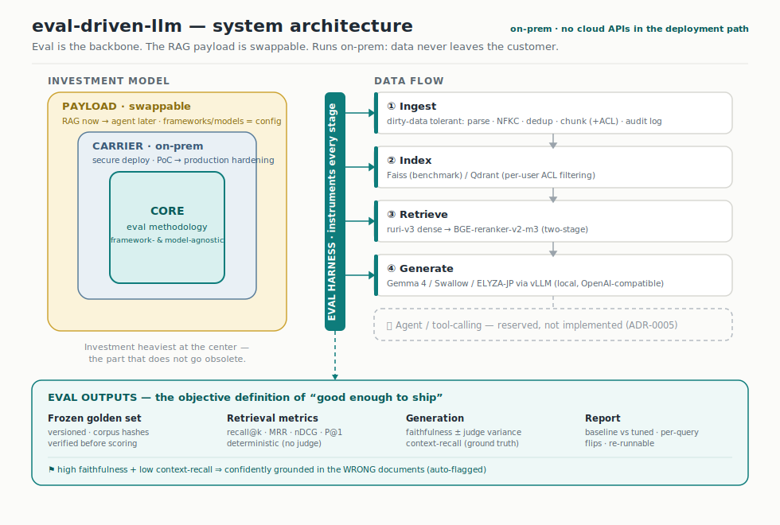

# Architecture



The system is organized as concentric rings. The investment is heaviest at the
center and lightest at the edge, because the center is the part that does not
go obsolete.

- **Core — eval / acceptance methodology.** Framework- and model-agnostic.
  Defines what "good enough to ship" means and makes it reproducible.
- **Carrier ring — on-prem deployment + PoC→production hardening.** The eval
  only means something attached to a real, deployed system. Data never leaves
  the customer's hardware.
- **Payload (swappable) — RAG today, agent later.** Retriever, vector store,
  models, frameworks are config entries measured against the core, not
  commitments.

## Data flow (Layer 1: retrieval + eval)

```
        ingest                 index               retrieve              generate
  ┌──────────────┐      ┌───────────────┐    ┌──────────────────┐   ┌─────────────┐
  │ dirty PDFs / │      │ vector store  │    │ dense (ruri-v3)  │   │ vLLM serve  │
  │ docs         │ ───▶ │ Faiss/Qdrant  │──▶ │   ↓ widen        │──▶│ Gemma3/JP   │──▶ answer
  │ clean/dedup/ │      │ (+ metadata   │    │ rerank (bge-v2-m3)│   │ via LiteLLM │
  │ chunk/normalize│    │  for perms)   │    │   ↓ top-k         │   └─────────────┘
  └──────────────┘      └───────────────┘    └──────────────────┘          │
         │                                                                   │
         └───────────────────────── eval harness (CORE) ◀────────────────────┘
              frozen golden set · deterministic retrieval metrics ·
              pinned-judge generation metrics · versioned report

  reserved (not implemented): agent / tool-calling extension point
```

## Enterprise-reality defaults (carried by the system, absent from demos)

These are deliberate and documented as selling points, not implemented
silently:

- dirty-data-tolerant ingestion (dedup, encoding/format anomalies, table/column
  handling, OCR noise)
- multi-user permissions via metadata-filtered retrieval (Qdrant)
- auditable logging + data classification hooks
- eval tied to business metrics, not only technical ones
- maintenance handover docs + a stable API for integration with existing systems

> The ASCII sketches above are the text fallback; the rendered diagram is
> `architecture.svg` (shown at the top of this file and in the README).
